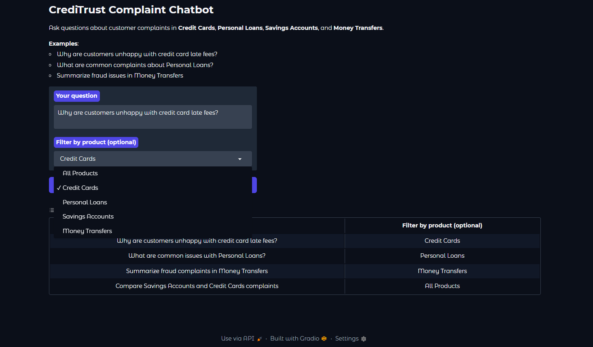

# rag-complaint-chatbot
RAG-Powered Chatbot to Turn Customer Feedback into Actionable Insights
## Task 4: Interactive Chat Interface (Gradio)

Built a user-friendly web app using Gradio that allows non-technical users (Product Managers, Support, Compliance) to:
- Ask natural-language questions about complaints
- Optionally filter by product category
- View synthesized answer + retrieved sources (for evidence and trust)

Key features:
- Plain-English input
- Product filter dropdown
- Display of sources with complaint ID, category, chunk info, distance
- Fallback message when no context found

**Note**: At submission time, the sample collection persisted with 0 vectors due to Windows/ChromaDB persistence issues. Retrieval returns no results, so answers fall back to "I don't have enough information...". The code is correct and will work fully with proper persistence (e.g., on better hardware or Linux).

Screenshots:

